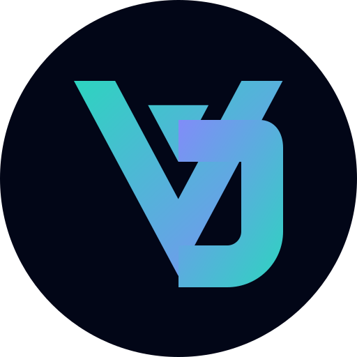

<div align="center">
  <a href="https://abdyuniors.github.io/">
    
  </a>

  <h1 align="center">Abdyunior Januar Suek — Portfolio</h1>

  <p align="center">
    <strong>Mobile & Web Developer based in Kupang, NTT.</strong><br>
    <em>Membangun aplikasi modern dengan performa tinggi, UI/UX interaktif, dan kode yang bersih.</em>
  </p>

  <p align="center">
    <a href="https://abdyuniors.github.io/"><strong>🌐 Kunjungi Website Langsung</strong></a>
  </p>

  <!-- Badges -->
  <p align="center">
    
    
    
    
  </p>
</div>

<!-- Gambar Preview Portofolio -->
<div align="center">
  <a href="https://abdyuniors.github.io/">
    
  </a>
  <br/>
  <i>☝️ Klik gambar di atas untuk melihat website secara langsung ☝️</i>
</div>

<br>

<br>

## 💡 Tentang Repositori Ini

Ini adalah *source code* untuk website portofolio pribadi saya. Dibangun dari nol menggunakan **Astro** dan **Tailwind CSS**, portofolio ini tidak hanya sekadar menampilkan riwayat proyek, tetapi juga mendemonstrasikan pemahaman saya tentang *Frontend Development*, interaksi UI (*Micro-interactions*), dan optimasi performa *rendering* di browser.

## ✨ Fitur Interaktif & UI/UX

- **Glassmorphism Theme:** Menggunakan kombinasi `backdrop-blur` dan transparansi warna yang presisi untuk menciptakan efek kaca premium pada Navbar dan Footer.
- **3D Tilt Elements:** Integrasi `vanilla-tilt.js` yang memberikan dimensi fisik dan efek *glare* pada foto profil serta kartu proyek saat disorot kursor.
- **Spotlight Hover:** Efek pendaran cahaya (*glow*) dinamis berbasis JavaScript yang mengikuti pergerakan kursor pengguna di dalam kartu *Tech Stack*.
- **Cosmic Canvas Background:** Partikel debu kosmik interaktif di latar belakang yang dirender menggunakan HTML5 `<canvas>`.
- **Dynamic Typing:** Animasi mengetik otomatis tanpa *library* eksternal.

## ⚡ Sorotan Performa (Lighthouse Optimized)

Aplikasi ini telah melalui proses optimasi ketat untuk memastikan tidak ada *lag* atau beban CPU yang berlebihan:

1. **Throttled Event Listeners:** Penggunaan `requestAnimationFrame` pada *scroll event* untuk mencegah *layout thrashing*.
2. **Auto-Pause Canvas:** Partikel latar belakang secara otomatis berhenti dirender saat *Hero Section* tidak terlihat di layar, menghemat penggunaan baterai dan CPU pengguna secara drastis.
3. **Hardware Acceleration:** Penggunaan `will-change: transform` dan `translateZ(0)` untuk memindahkan beban efek *blur* berat dari CPU ke GPU (VGA).
4. **Image Optimization:** Penggunaan `astro:assets` untuk konversi format WebP, *resizing*, dan *lazy-loading* secara otomatis.
5. **Code Splitting:** Script Vanilla Tilt hanya dimuat di halaman yang membutuhkannya, tidak membebani *layout* utama.

## 🚀 Panduan Instalasi Lokal

Ingin menjalankan proyek ini di komputer Anda? Sangat mudah:

```bash
# 1. Clone repositori
git clone [https://github.com/abdyuniors/abdyuniors.github.io.git](https://github.com/abdyuniors/abdyuniors.github.io.git)

# 2. Masuk ke direktori proyek
cd abdyuniors.github.io

# 3. Instal dependencies
npm install

# 4. Jalankan server lokal
npm run dev

Buka `http://localhost:4321` di browser Anda untuk melihat hasilnya.

## 🛠️ Stack Teknologi Terapan

| Kategori | Teknologi / Library |
| :--- | :--- |
| **Framework Utama** | [Astro](https://astro.build/) |
| **Styling** | [Tailwind CSS](https://tailwindcss.com/) |
| **Animasi Scroll** | [AOS (Animate on Scroll)](https://michalsnik.github.io/aos/) |
| **Animasi Fisik / 3D** | [Vanilla-tilt.js](https://micku7zu.github.io/vanilla-tilt.js/) |
| **Deployment** | GitHub Pages & GitHub Actions |

## 📫 Mari Terhubung

Saya sangat terbuka untuk peluang kolaborasi, *freelance*, maupun pekerjaan *full-time*.
